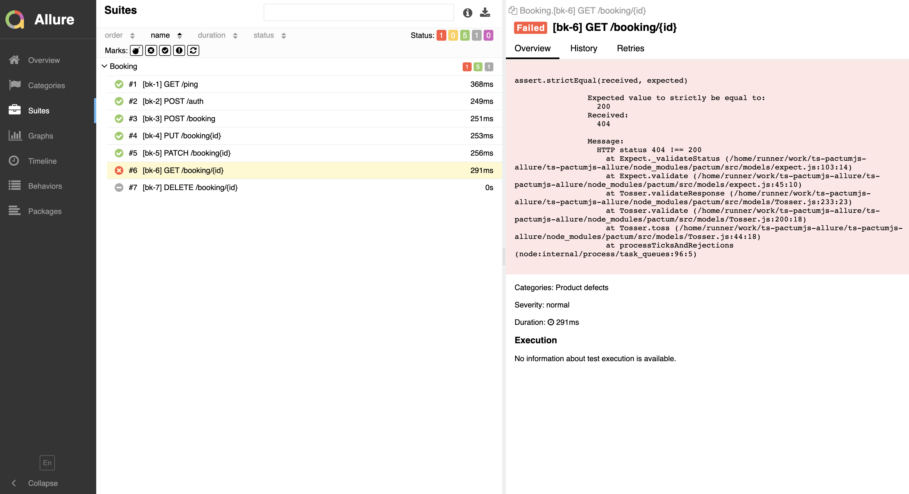

# Test automation

**REST API Testing Tool for all levels in a Test Pyramid**

**Following tools were used in this framework:**  
TypeScript, Jest, PactumJS, Allure Report, Docker, GitHub

## ABOUT PROJECT
Project made in my spare time to develop my skills in automation testing.  

PactumJS is a REST API Testing Tool used to automate e2e, integration, contract & component (or service level) tests.
Supported tests executors:
- *Swift*
- *Lightweight*
- *Simple & Powerful*
- *Compelling Mock Server*
- *Elegant Data Management*
- *Extendable & Customizable*
- *Clear & Comprehensive Testing Style*
- *Component, Contract & E2E testing of APIs*

## DOCUMENTATION
This readme offers an basic introduction to the library. Head over to the full documentation at https://pactumjs.github.io

- [API Testing](https://pactumjs.github.io/guides/api-testing.html)
- [Integration Testing](https://pactumjs.github.io/guides/integration-testing.html)
- [Component Testing](https://pactumjs.github.io/guides/component-testing.html)
- [Contract Testing](https://pactumjs.github.io/guides/contract-testing.html)
- [E2E Testing](https://pactumjs.github.io/guides/e2e-testing.html)
- [Mock Server](https://pactumjs.github.io/guides/mock-server.html)

## USAGE
PactumJS can be used for all levels of testing in a test pyramid. It can also act as an standalone mock server to generate contracts for contract testing.

## API Testing
Tests in pactum are clear and comprehensive. It uses numerous descriptive methods to build your requests and expectations.

###  Simple Test Cases

## FEATURES
- Support for [Allure Report](https://ugenlaps.github.io/ts-pactumjs-allure)
- Support for Parallel Testing
- Support for GitHub [CI/CD](https://github.com/UgenLaps/ts-pactumjs-allure/actions)
- Support for Docker
- Support for Fake & Mock data
- Support for .yaml files

## HOW TO RUN TESTS
There are multiple ways to run tests from this build. It all depends on what do you want to do

### CI/CD
- The tests start automatically after a new commit
- You can run the tests manually in the category [Actions](https://github.com/UgenLaps/ts-pactumjs-allure/actions)
- After each run of the CI/CD cycle, test results will be automatically uploaded to
the environment where the tests were run (GitHub)
You can check the test results at the [public access link](https://ugenlaps.github.io/ts-pactumjs-allure)

### Localhost
- Clone the project to your local computer.
- Run the command `npm install` to install all dependencies
- Execute the `npm run test` command to run the tests

After each run of a LOCAL loop, two types of log information are stored inside the repository along with test results.
- Allure HTML report in allure-results directory.

In a terminal, type `allure generate --clean` to generate Allure test results.

## TEST RESULTS AND TEST PROTOCOLS

| FAIL MESSAGE                                      | PASS MESSAGE                                    |
|---------------------------------------------------|-------------------------------------------------|
|  |  |

## LICENSE
This project is licensed under the MIT License - see the [LICENSE](LICENSE) file for details
